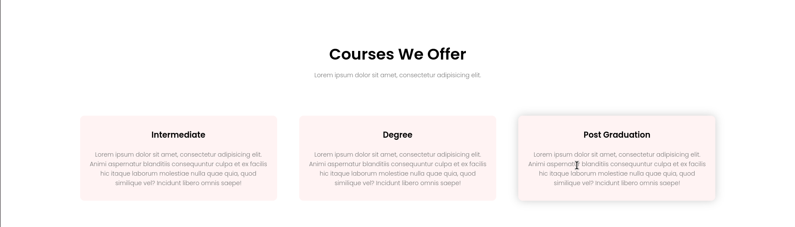

# World's Biggest University Website

## Description
Ce projet est une maquette HTML d'un site web pour la "World's Biggest University".

L'objectif est de mettre en avant les nombreux avantages de cette université à travers une interface attrayante, moderne et interactive. Le site comprend plusieurs sections comme les cours proposés, les campus, les installations, les témoignages des étudiants et une invitation à explorer davantage.

---

## Fonctionnalités principales
1. **Navigation simple** : Menu interactif avec des liens vers les différentes sections du site.
2. **Page d'accueil engageante** : Mise en avant de l'université avec un message inspirant.
3. **Sections clés** :
    - **Cours offerts** : Présentation des différents niveaux d'études disponibles (intermédiaire, diplôme, post-graduation).
    - **Campus mondiaux** : Découvrez les campus situés à Londres, New York et Washington avec des visuels immersifs.
    - **Installations modernes** : Bibliothèque de classe mondiale, terrains de sport, cafétéria, et bien plus.
    - **Témoignages d'étudiants** : Retours d'expérience des étudiants avec des évaluations étoilées.
4. **Call to Action (CTA)** : Une section dédiée pour encourager les visiteurs à s'inscrire à des cours en ligne.
5. **Responsive Design** : Compatible avec différents appareils grâce à l'utilisation des médias CSS et de la bibliothèque Font Awesome.

---

## Contenu du projet
- **Fichiers HTML et CSS** : Pour la structure et le style du site.
- **Polices Google Fonts** : `Abril Fatface`, `Montserrat`, et `Poppins` pour une typographie moderne.
- **Bibliothèque Font Awesome** : Pour les icônes interactives dans les menus et les sections.
---

## Aperçu visuel

### Page d'accueil (Header)

La bannière d'accueil présente un design élégant avec un appel à l'action clair pour inviter les visiteurs à découvrir l'université.

### Section "Courses We Offer"

Une présentation visuelle des différents cours proposés par l'université : intermédiaire, diplôme, et post-graduation.

### Section "Our Global campus"

Une section qui permet de montrer les différent campus de l'université dans le monde.

### Section "Our Global campus"

La section "Our Student Says" a pour but de renforcer la crédibilité de l'université en mettant en avant les retours positifs des étudiants. Elle aide à établir une connexion émotionnelle avec les visiteurs du site en partageant des expériences authentiques et des témoignages de réussite.

### Section "Our Facilities"

La section "Facilities" a pour but de présenter les ressources matérielles et les services proposés par l'université. Elle met en avant les atouts qui améliorent la vie étudiante, comme une bibliothèque moderne, des espaces sportifs, ou des lieux de détente, pour séduire les visiteurs et convaincre les futurs étudiants.

---

## Technologies utilisées

Ce projet de maquette utilise les technologies suivantes :

- **HTML5** : Pour structurer et organiser le contenu de la page.
- **CSS3** : Pour la mise en page et le style visuel du site.
- **Google Fonts** : Pour utiliser des polices modernes et élégantes, comme *Abril Fatface*, *Montserrat* et *Poppins*.
- **Font Awesome** : Pour intégrer des icônes modernes et interactives.